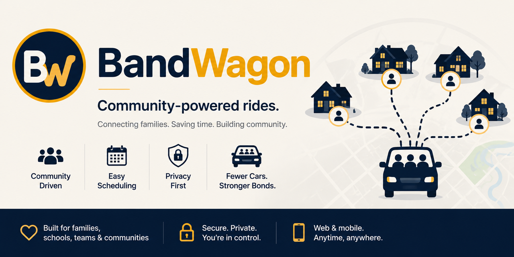

# BandWagon



<p align="center">
  <strong>Community-powered rides for families, schools, teams, and local organizations.</strong><br>
  Connect families. Save time. Build community.
</p>

<p align="center">
  <a href="https://bandwagon.harrisonward.net">Platform</a> ·
  <a href="https://flomogo.app">FloMoGo</a> ·
  <a href="https://bandwagon-demo.harrisonward.net/">Interactive demo</a> ·
  <a href="docs/ROADMAP-TO-V1.md">Roadmap</a> ·
  <a href="docs/operations/V1-LAUNCH-CHECKLIST.md">Launch checklist</a> ·
  <a href="CONTRIBUTING.md">Contributing</a>
</p>

<p align="center">
  <a href="https://github.com/harrisonwardtechnology/BandWagon/actions/workflows/web-build.yml"></a>
  
  
  
</p>

## What is BandWagon?

BandWagon is a privacy-first community carpool coordination platform developed and maintained by **Harrison Ward Technology**. It helps trusted groups organize events, coordinate ride requests and offers, match available seats, communicate important updates, and complete safer pickups—without becoming a public rideshare marketplace.

**FloMoGo** is the first community powered by BandWagon, serving the Flower Mound band community.

> **Hop on the BandWagon.**

## Try the interactive demo

Explore the complete fake-data walkthrough at **[bandwagon-demo.harrisonward.net](https://bandwagon-demo.harrisonward.net/)**. It demonstrates the BandWagon experience without connecting to production APIs, sending messages, or creating real rides.

## Built for real community coordination

| | Capability |
|---|---|
| 📅 | **Flexible events** — organizer-created events plus read-only Google and Microsoft calendar sync |
| 🚙 | **Ride coordination** — request, offer, match, pool, confirm, and complete community rides |
| 👨‍👩‍👧‍👦 | **Households and guardians** — family accounts, managed students, consent, and age-aware controls |
| 🛡️ | **Safety by design** — driver eligibility, credential review, emergency workflows, and verified pickup handshakes |
| 🔔 | **Useful notifications** — email, SMS/RCS, and web push with preference, abuse, and budget controls |
| 🏘️ | **Multi-organization** — tenant boundaries, organization policies, branding, domains, and admin tools |
| 🔐 | **Privacy operations** — encrypted sensitive data, retention controls, exports, deletion workflows, and audit trails |
| ♿ | **Accessible everywhere** — responsive web and installable PWA experiences built for phones and desktops |

## How it works

```text
Organization creates or syncs an event
                    ↓
      Families request or offer rides
                    ↓
       BandWagon proposes a safe match
                    ↓
     Participants review and confirm it
                    ↓
       Reminders + verified pickup flow
                    ↓
          Ride outcome is recorded
```

People remain in control throughout the workflow. Automated assistance can propose events or matches, but organization administrators and participants make the decisions.

## Project status

BandWagon is moving through its **v1 release-candidate and production-readiness phase**. The core application, database migrations, calendar integrations, scheduled operations, health monitoring, and automated test pipeline are in place. Final launch evidence and live pilot validation are tracked in the authoritative [v1 launch checklist](docs/operations/V1-LAUNCH-CHECKLIST.md).

- [Current v1 release-candidate scope](docs/releases/1.0.0-rc1.md)
- [Roadmap through v2](docs/ROADMAP-TO-V1.md)
- [Detailed v2 roadmap and sprint map](docs/V2-ROADMAP-AND-SPRINT-MAP.md)
- [Automated testing strategy](docs/TEST_AUTOMATION.md)

## Technology

- **Application:** Next.js 15, React 19, TypeScript
- **Data:** PostgreSQL 17, PostGIS, Redis
- **Storage:** private S3-compatible object storage
- **Integrations:** Google and Microsoft calendars, Google Routes, Twilio, SMTP, web push
- **Operations:** Docker, Coolify, GitHub Actions, health and synthetic monitoring

## Run it locally

The production application lives in `apps/web`.

```bash
cd apps/web
npm ci
npm run dev
```

Open [http://localhost:3000](http://localhost:3000). PostgreSQL/PostGIS and Redis are required for the complete application; see the [deployment guide](docs/COOLIFY.md) and [`apps/web/README.md`](apps/web/README.md) for environment and infrastructure setup.

Before proposing a change, run the same core gates used by CI:

```bash
cd apps/web
npm run db:migrate
npm run db:verify
npm test
npm run typecheck
npm run build
```

## Repository map

```text
BandWagon/
├── apps/web/          # Production Next.js application, APIs, migrations, and tests
├── demo/              # Fake-data-only interactive product walkthrough
├── docs/              # Product, operations, security, deployment, and user guides
├── config/            # Environment schema and shared configuration references
└── .github/workflows/ # CI and production synthetic monitoring
```

The demo never calls production APIs, uses production credentials, sends real notifications, or creates real rides.

## Documentation

### Get started

- [Organization setup](docs/ORGANIZATION-SETUP.md)
- [Parent and student guide](docs/PARENT-STUDENT-GUIDE.md)
- [Driver guide](docs/DRIVER-GUIDE.md)
- [PWA installation](docs/PWA-INSTALL.md)
- [Events and calendars](docs/EVENTS.md)

### Deploy and operate

- [Coolify deployment](docs/COOLIFY.md)
- [GitHub-to-Coolify launch guide](docs/GITHUB-DEPLOY.md)
- [Custom organization domains](docs/CUSTOM-DOMAINS.md)
- [Production security](docs/SECURITY-DEPLOYMENT.md)
- [Messaging abuse controls](docs/MESSAGING-ABUSE-CONTROLS.md)

Before a FloMoGo production release, run `npm run release:check-env:flomogo` from `apps/web`. The checker reports missing controls without printing secret values.

## Safety and privacy boundaries

BandWagon helps people who already belong to a community voluntarily coordinate rides. It does **not** provide transportation, dispatch or certify drivers, supervise rides, or track vehicles. Participating organizations are not automatically affiliated with, sponsors of, endorsers of, or operators of the platform.

Never place real rider, driver, household, address, phone, email, calendar, or message data in source code, tests, screenshots, or public issues. Review [CONTRIBUTING.md](CONTRIBUTING.md) before submitting changes and follow [SECURITY.md](SECURITY.md) for private vulnerability reporting.

---

<p align="center">
  Built with care by <strong>Harrison Ward Technology</strong>.<br>
  <strong>Fewer cars. Stronger bonds.</strong>
</p>
