# BandWagon

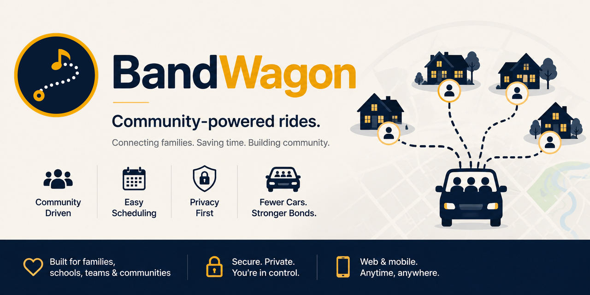

<p align="center">
  <strong>Community-powered rides for families, schools, teams, and local organizations.</strong><br>
  Connect families. Save time. Build community.
</p>

<p align="center">
  <a href="https://bandwagon.club">Platform</a> ·
  <a href="https://flomogo.app">FloMoGo</a> ·
  <a href="https://demo.bandwagon.club/">Interactive demo</a> ·
  <a href="https://status.bandwagon.club/">Status</a> ·
  <a href="docs/README.md">Docs</a> ·
  <a href="docs/ROADMAP-TO-V1.md">Roadmap</a> ·
  <a href="docs/operations/V1-LAUNCH-CHECKLIST.md">Launch checklist</a> ·
  <a href="CONTRIBUTING.md">Contributing</a>
</p>

<p align="center">
  <a href="https://github.com/harrisonwardtechnology/BandWagon/actions/workflows/web-build.yml"></a>
  
  
  
</p>

## Screenshots

Light or dark follows your GitHub theme, just like the app follows your device.

<p align="center"><picture><source media="(prefers-color-scheme: dark)" srcset="docs/assets/screenshots/home-desktop-dark.png">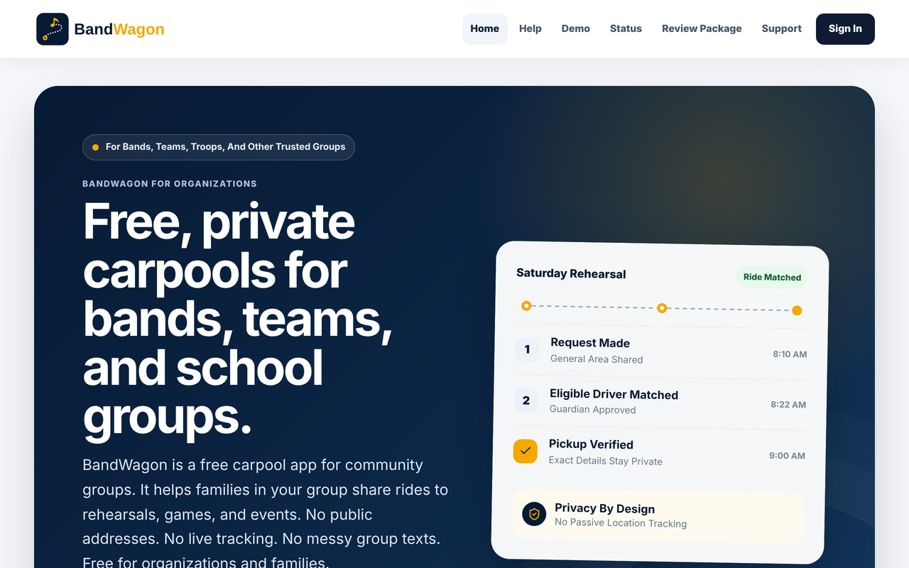</picture></p>

| Family Home | Rides | Admin Setup |
| --- | --- | --- |
| <picture><source media="(prefers-color-scheme: dark)" srcset="docs/assets/screenshots/family-home-desktop-dark.png">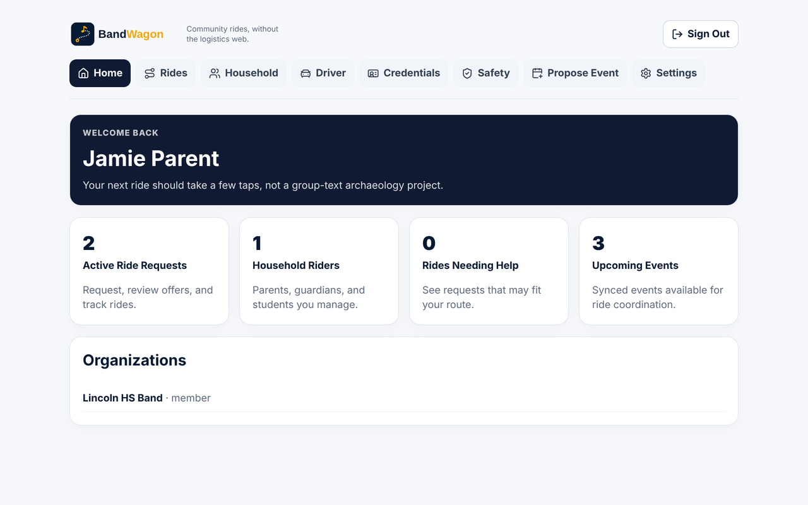</picture> | <picture><source media="(prefers-color-scheme: dark)" srcset="docs/assets/screenshots/rides-desktop-dark.png">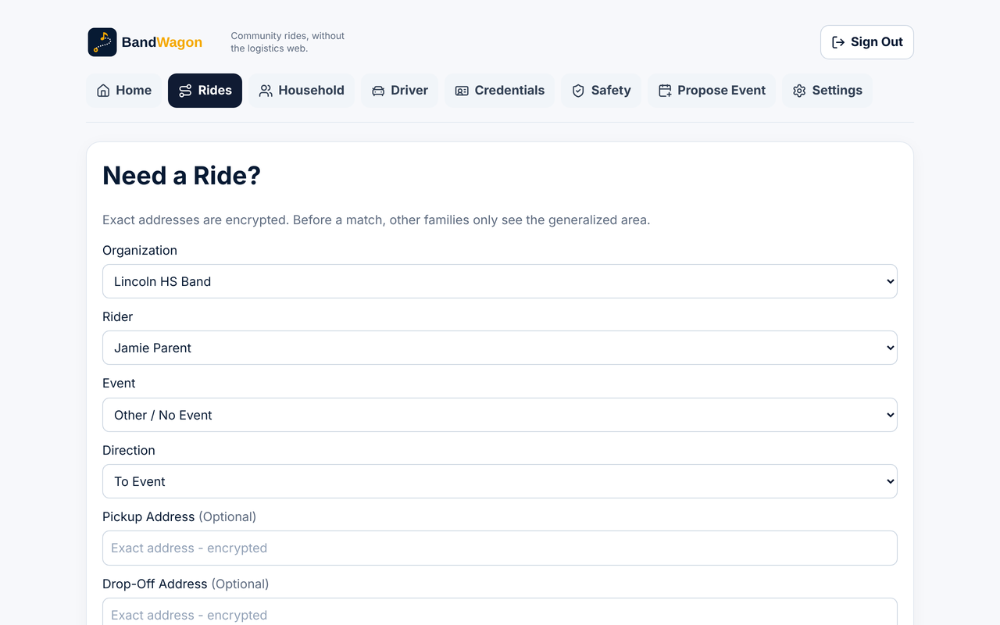</picture> | <picture><source media="(prefers-color-scheme: dark)" srcset="docs/assets/screenshots/setup-desktop-dark.png">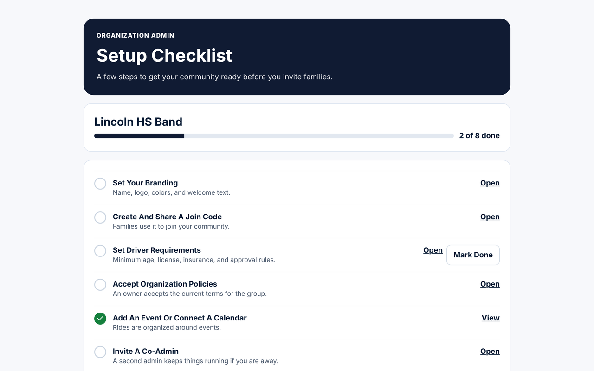</picture> |

| Sign In | What's New | Friendly 404 |
| --- | --- | --- |
| <picture><source media="(prefers-color-scheme: dark)" srcset="docs/assets/screenshots/sign-in-desktop-dark.png">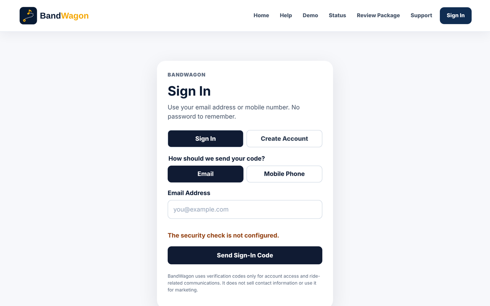</picture> | <picture><source media="(prefers-color-scheme: dark)" srcset="docs/assets/screenshots/whats-new-desktop-dark.png">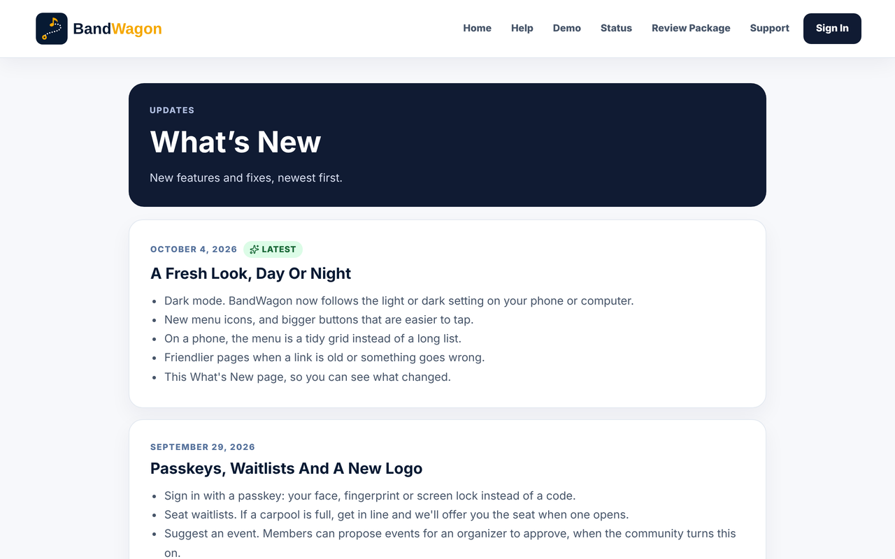</picture> | <picture><source media="(prefers-color-scheme: dark)" srcset="docs/assets/screenshots/not-found-desktop-dark.png">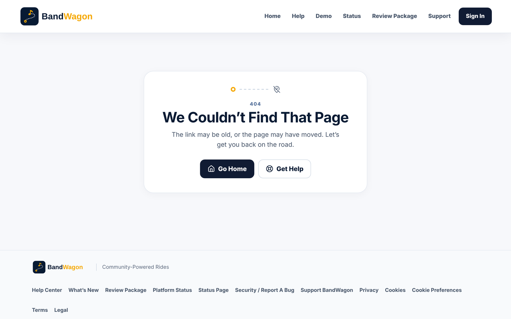</picture> |

<p align="center"><picture><source media="(prefers-color-scheme: dark)" srcset="docs/assets/screenshots/family-home-phone-dark.png">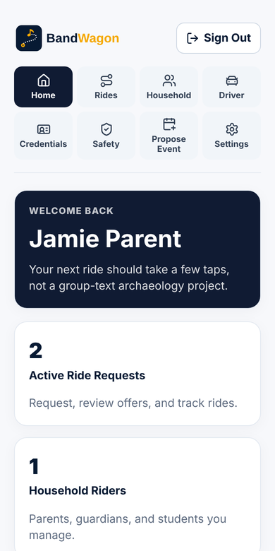</picture> <picture><source media="(prefers-color-scheme: dark)" srcset="docs/assets/screenshots/rides-phone-dark.png">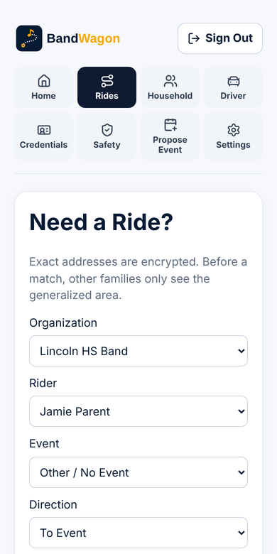</picture> <picture><source media="(prefers-color-scheme: dark)" srcset="docs/assets/screenshots/sign-in-phone-dark.png">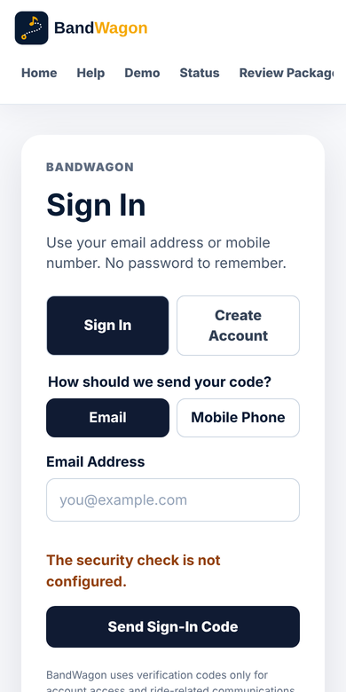</picture></p>

## What is BandWagon?

BandWagon helps families in the same school, band, team, or club share rides to events. Parents ask for a ride, trusted drivers offer seats, and the parent says yes, all without handing your address or phone number to everyone in the group.

**FloMoGo** is the first community powered by BandWagon, serving the Flower Mound band community. BandWagon is built and maintained by **Harrison Ward Technology**.

> **Hop on the BandWagon.**

## What It Does

**Who it's for.** BandWagon is for groups where the families already know each other a little: a marching band, a sports team, a school club, a youth group. Each group gets its own private community with its own members, events, rules, and look. Families can belong to more than one community without setting up their family twice.

**The problem.** Today, rides to rehearsals and games usually get sorted out in a giant group text. Addresses and phone numbers get shared with everyone, kids fall through the cracks, nobody knows who is actually picking up whom, and the same few parents end up doing all the driving.

**How it works for families.** Your community's events show up in BandWagon, either added by an organizer or pulled in from the group's Google or Microsoft calendar. A parent picks the event, picks the kid, picks a direction (to the event, from it, or round trip) and asks for a ride. Other families only see a general area like "near the high school" until a ride is confirmed. Drivers see who needs help and offer seats, and the parent chooses which offer to accept. If a carpool is full, you can join its waitlist and get offered the seat when one opens up.

**How it works for drivers.** Drivers turn on driving for each community separately, set how many seats they have, and meet whatever rules that community sets (minimum age, license, volunteer approval, and so on). An optional helper called RouteAssist points out open requests that are close to a trip they are already making. On ride day, drivers tap simple buttons (On My Way, I Have Arrived, Picked Up, Complete Ride) and, if the family asks for it, both sides confirm a one-time pickup check so the kid gets in the right car.

**How it works for organizers.** Community admins approve members, set driver rules, manage events, see waitlists, and get plain reports on how much carpooling the group has done. BandWagon is free for organizations, and a new community is reviewed by the platform owner before it goes live.

**What it is not.** BandWagon is not a taxi service, school transportation, or emergency dispatch. It does not certify drivers and it does not track anyone's car. People make every decision; the app just helps them coordinate.

## How It Works

1. An organizer adds an event, or it syncs in from the community's calendar.
2. A parent (or a trusted adult they picked) asks for a ride for their kid.
3. If the kid asked on their own, a guardian approves it first.
4. Drivers see the general area and timing, then offer seats. RouteAssist can suggest good fits.
5. The parent accepts one offer. The exact pickup address is shared with that driver only.
6. Reminders go out the day before and an hour before.
7. On ride day the driver taps through the ride steps, and both sides can confirm the pickup with a QR code or a four digit code.
8. The ride is marked complete (or cancelled, or a no show) and kept on record.

## Features

### Accounts And Sign In

- Sign in with a one-time code sent by email or text. No password to remember.
- Optional passkeys (face, fingerprint, or screen lock), managed from your Security settings.
- Phone numbers can be typed any common way and are cleaned up automatically.
- Your phone and email stay hidden from other members by default, even though they still work for sign in and alerts.

### Households, Students, And Guardians

- One household can hold parents, guardians, students, and other riders, and can join several communities.
- Add a student, give guardian consent, and optionally let the student sign in to their own profile with an emailed code.
- Choose per student whether every ride request needs a guardian's OK before drivers can see it.
- Choose per student whether the one-time pickup check is required.
- Join a community with the join code your organization gives you.

### Trusted Adults

- Invite a grandparent, nanny, or co-parent in another home to help with rides.
- Pick exactly what they can do: ask for rides, approve rides, see ride details, and get alerts.
- Cover all your kids or just some, and set an optional end date.
- Pause, resume, or remove a trusted adult any time. Access stops right away.
- Invites are single use and expire after 7 days.

### Events And Calendars

- Organizers create and edit events by hand.
- Read-only sync from Google Calendar and Microsoft 365 or Outlook calendars, with a choice of which calendars to use.
- Duplicate and overlapping calendar entries are caught and can be merged or kept separate.
- Each event can have ride requests turned on or off.
- Member event proposals (off by default): members suggest an event, and an organizer approves, asks for changes, or declines it.
- AI event intake (off by default): paste an email or announcement and AI drafts the event. An admin must review and publish it.

### Asking For And Offering Rides

- Request a ride to an event, from an event, or a round trip, with pickup and drop-off addresses.
- A privacy preview shows what others will see before you send.
- Several drivers can offer on the same request, and the parent picks one.
- Drivers can see a list of rides needing help in their community and offer seats.
- Carpools: more than one rider can be added to a single ride when the driver allows it.
- Drivers can change the seats in their car, and a missed pickup can be reported as a no show.
- Every ride gets a short, hard to guess link.

### Waitlists

- Join the waitlist on a full carpool instead of being turned away.
- First come, first served. You see your place in line, but not other riders' names.
- When a seat opens, the next person gets a timed offer to accept or pass.
- Organizers can turn waitlists on or off and set how long people get to accept.
- Waitlists clear themselves when a carpool leaves or is cancelled, and everyone is told why.

### Drivers And RouteAssist

- Turn driving on or off for each community separately, and pause it any time.
- Set available seats and a simple vehicle label and color.
- RouteAssist (optional) suggests open requests along a route you are already driving, within the extra minutes and detour limits you set. It never accepts a ride for you.
- "Why This Match?" explains each suggestion, and "Not This One" hides it.
- Optional alert when a good RouteAssist match shows up.

### Safety And Trust

- Each community sets its own driver rules: minimum age, driver license, district volunteer approval, manual admin approval, and whether eligibility is paused when a document expires.
- Credential vault: drivers upload documents to private storage. Optional automatic reading pulls out facts like expiration dates, but a person always makes the approval call.
- Verified Pickup: the rider scans a one-time QR code (or types a four digit code) and both screens show the same color, word, and icon. Both sides must confirm.
- Emergency Assist: alert your ride's safety circle during an active ride and mark alerts resolved. It always reminds you to call 911 for real emergencies.
- Exact addresses are encrypted and only shown to the matched driver. Before that, others see a rough area.
- Every look at an exact address is logged.

### Notifications And Texts

- Push notifications first, then email, with texts (SMS or RCS) saved for urgent things like a driver arriving or a last minute cancellation.
- Reminders 24 hours and 1 hour before a ride.
- You choose which channels you want, including texts only for urgent alerts.
- Texts are strictly opt in with a separate unchecked box. STOP, START, and HELP always work.
- Your settings page shows your recent deliveries and 30 day delivery health.
- Per community texting limits and abuse controls keep message volume and cost in check.

### Privacy And Your Data

- Download your data or delete your account from Privacy and Data settings.
- Old documents and location data are cleaned up automatically on a schedule.
- No live GPS tracking. Drivers tap status buttons; the app does not record routes or speed.
- Installable app for phones (PWA) that still opens when you are offline.

### Community Admin Tools

- Request a new community at `/start`. The platform owner reviews it, and an approved community gets its own web address.
- Setup checklist that tracks progress: join code, driver rules, policies, first event, a co-admin, and a test ride.
- Invite admins and managers by email.
- Branding: your community homepage can use your own details and button color.
- Custom domains: use your own web address after proving you own it.
- Impact report: estimated car trips, miles, and minutes saved, with a CSV for board meetings and an optional public impact page. Small numbers are hidden to protect privacy.
- Local sponsors: thank businesses on the public impact page. Sponsors never see who rides, who drives, or where anyone lives.
- Waitlist, household delegate, and event proposal views for each community.

### Platform Admin And Support

- Platform overview with usage, feature adoption, messaging health, and 24 hour health.
- Usage and cost trends, a monthly budget with alerts, and a month end forecast. Budget alerts never shut off rides or safety features.
- Support View: a read-only, time limited "view as" mode with a stated reason, scoped to one community for org admins.
- Audit explorer for support access, approvals, domain changes, and admin actions.
- Feature request board at `/help/ideas` where people suggest and vote on ideas, with an admin review queue.
- Help center, support contact form, security report page, and a public status page.
- Optional donations and sponsorship payments through Stripe.

## Try the interactive demo

Explore the complete fake-data walkthrough at **[demo.bandwagon.club](https://demo.bandwagon.club/)**. It demonstrates the BandWagon experience without connecting to production APIs, sending messages, or creating real rides.

## Project status

BandWagon is moving through its **v1 release-candidate and production-readiness phase**. The core application, database migrations, calendar integrations, scheduled operations, health monitoring, and automated test pipeline are in place. Final launch evidence and live pilot validation are tracked in the authoritative [v1 launch checklist](docs/operations/V1-LAUNCH-CHECKLIST.md).

- [Current v1 release-candidate scope](docs/releases/1.0.0-rc1.md)
- [Roadmap through v2](docs/ROADMAP-TO-V1.md)
- [Detailed v2 roadmap and sprint map](docs/V2-ROADMAP-AND-SPRINT-MAP.md)
- [Automated testing strategy](docs/TEST_AUTOMATION.md)

## Technology

- **Application:** Next.js 15, React 19, TypeScript
- **Data:** PostgreSQL 17, PostGIS, Redis
- **Storage:** private S3-compatible object storage
- **Integrations:** Google and Microsoft calendars, Google Routes, Twilio, SMTP, web push
- **Operations:** Docker, Coolify, GitHub Actions, health and synthetic monitoring

## Run it locally

The production application lives in `apps/web`.

```bash
cd apps/web
npm ci
npm run dev
```

Open [http://localhost:3000](http://localhost:3000). PostgreSQL/PostGIS and Redis are required for the complete application; see the [deployment guide](docs/COOLIFY.md) and [`apps/web/README.md`](apps/web/README.md) for environment and infrastructure setup.

Before proposing a change, run the same core gates used by CI:

```bash
cd apps/web
npm run db:migrate
npm run db:verify
npm test
npm run typecheck
npm run build
```

## Repository map

```text
BandWagon/
├── apps/web/          # Production Next.js application, APIs, migrations, and tests
├── demo/              # Fake-data-only interactive product walkthrough
├── docs/              # Product, operations, security, deployment, and user guides
├── config/            # Environment schema and shared configuration references
└── .github/workflows/ # CI and production synthetic monitoring
```

The demo never calls production APIs, uses production credentials, sends real notifications, or creates real rides.

## Documentation

**Full index: [docs/README.md](docs/README.md)**

### Get started

- [User guide](docs/USER-GUIDE.md)
- [Organization setup](docs/ORGANIZATION-SETUP.md)
- [Parent and student guide](docs/PARENT-STUDENT-GUIDE.md)
- [Driver guide](docs/DRIVER-GUIDE.md)
- [Household delegates](docs/HOUSEHOLD-DELEGATES.md)
- [Waitlists](docs/WAITLISTS.md)
- [Events and calendars](docs/EVENTS.md) and [event proposals](docs/EVENT-PROPOSALS.md)
- [Passkeys](docs/PASSKEYS.md)
- [SMS consent and texts](docs/SMS-CONSENT-AND-TEXTS.md)
- [PWA installation](docs/PWA-INSTALL.md)

### Deploy and operate

- [Coolify deployment](docs/COOLIFY.md)
- [GitHub-to-Coolify launch guide](docs/GITHUB-DEPLOY.md)
- [V1 launch checklist and status](docs/operations/V1-LAUNCH-CHECKLIST.md)
- [Email domain (Proofpoint, M365, DMARC, MTA-STS, BIMI)](docs/operations/EMAIL-DOMAIN.md)
- [Cloudflare and caching](docs/operations/CLOUDFLARE-PERFORMANCE.md)
- [Google OAuth verification](docs/operations/GOOGLE-OAUTH-VERIFICATION.md)
- [Custom organization domains](docs/CUSTOM-DOMAINS.md)
- [Production security](docs/SECURITY-DEPLOYMENT.md)
- [Messaging abuse controls](docs/MESSAGING-ABUSE-CONTROLS.md)
- [Staging environment](docs/operations/STAGING.md)
- [Branding and logo files](docs/BRANDING.md)

Before a FloMoGo production release, run `npm run release:check-env:flomogo` from `apps/web`. The checker reports missing controls without printing secret values.

## Safety and privacy boundaries

BandWagon helps people who already belong to a community voluntarily coordinate rides. It does **not** provide transportation, dispatch or certify drivers, supervise rides, or track vehicles. Participating organizations are not automatically affiliated with, sponsors of, endorsers of, or operators of the platform.

Never place real rider, driver, household, address, phone, email, calendar, or message data in source code, tests, screenshots, or public issues. Review [CONTRIBUTING.md](CONTRIBUTING.md) before submitting changes and follow [SECURITY.md](SECURITY.md) for private vulnerability reporting.

---

<p align="center">
  Built with care by <strong>Harrison Ward Technology</strong>.<br>
  <strong>Fewer cars. Stronger bonds.</strong>
</p>
