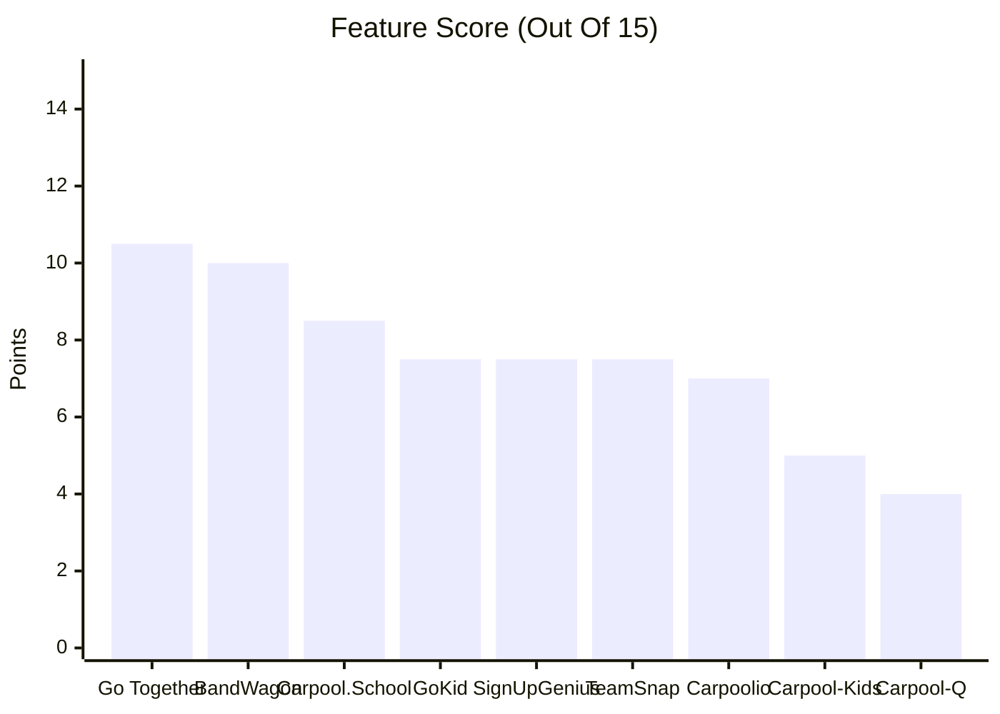
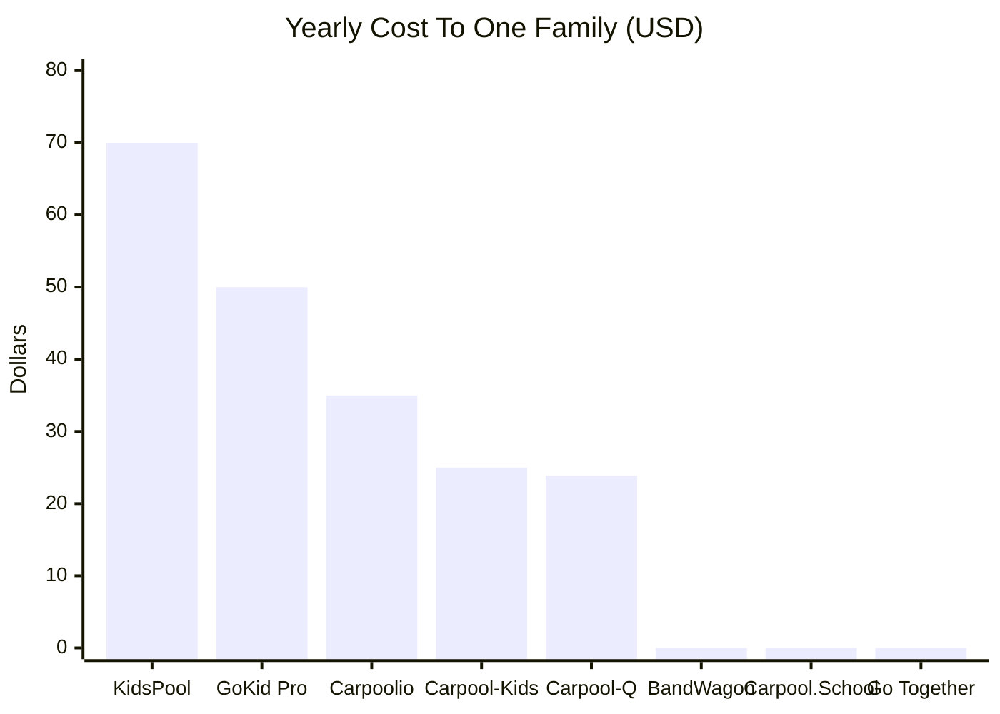

# BandWagon Competitor Analysis

Last Updated: September 28, 2026 · Owner: Harrison Ward Technology

A look at every app that does some part of what BandWagon does, how each one stacks up, where BandWagon wins today, plus the gaps worth closing.

## Quick Take

- **The market splits in two.** Cheap apps for small parent groups (GoKid, Carpool-Kids, Carpool-Q, Carpoolio) or pricey school programs sold to districts (GoKid Connect, Go Together, Carpool.School).
- **Nobody free covers the whole org.** Family apps charge each household $15 to $70 a year. School programs charge the school $400 to $8,000+ a year. BandWagon is free to both.
- **BandWagon's lane is open.** Band, booster, team, church, club groups who want their own branded space with events, households, safety checks, waitlists. No one else targets them directly.
- **Biggest gaps:** recurring rides (on the V2.1 roadmap), driver rotation, live ride tracking.
- **Graveyard:** Waze Carpool shut down in 2022. Chaperone (last update 2016) plus Pogo Rides (last update 2020) look abandoned. Lesson: free community apps die when there's no one paying the bills. BandWagon's donation plus sponsor model needs to hold up.

## Who's Out There

| App | Built For | Who Pays | Status |
|---|---|---|---|
| **BandWagon** | Community orgs (bands, boosters, teams, schools) plus their families | Nobody (donations, sponsors) | Release candidate |
| **GoKid** | Families; schools via GoKid Connect | Families (Pro) or school (Connect) | Active |
| **Carpool-Kids** | Families, sports teams | Families (Pro) | Active |
| **Carpool-Q** | Small parent groups (3 to 6 families) | Families | Active, new |
| **Carpool.School** | Schools, daycares, teams, camps | Org (families free) | Active, small |
| **Go Together (SchoolPool)** | K-12 districts | School or grant | Active |
| **Carpoolio** | Families, teams | Families (teams by quote) | Active, new |
| **SignUpGenius** | Anyone making signup sheets | Organizer | Active |
| **TeamSnap** | Sports teams | Team or families | Active |
| **HopSkipDrive** | Districts, families needing paid drivers | Per ride | Active (different model) |
| Waze Carpool | Commuters | Free | Shut down 2022 |
| Chaperone | Families | Tokens | Abandoned (2016) |
| Pogo Rides | Families | Free | Abandoned (2020) |

## Feature Chart

Key: ✅ yes · 🟡 partly, paid tier only, or only when a school buys it · ❌ no · ❔ couldn't confirm · 🗓️ on the BandWagon roadmap

| Feature | BandWagon | GoKid | Carpool-Kids | Carpool-Q | Carpool.School | Go Together | Carpoolio | SignUpGenius | TeamSnap |
|---|---|---|---|---|---|---|---|---|---|
| Recurring rides | 🗓️ V2.1 | ✅ | ✅ | ✅ | ✅ | ✅ | ✅ | ✅ | 🟡 |
| Fair driver rotation | ❌ | ❔ | 🟡 | ❌ | ❔ | ❔ | ✅ | ❌ | ❌ |
| One-off event rides | ✅ | ✅ | ✅ | ✅ | ✅ | ✅ | ✅ | ✅ | ✅ |
| Request / offer seat matching | ✅ | ❔ | 🟡 | ❌ | ✅ | ✅ | ❔ | ✅ | ✅ |
| Find new carpool partners | 🟡 in org | 🟡 | ❌ | ❌ | ✅ | ✅ | ❌ | ❌ | ❌ |
| Live GPS during ride | 🗓️ opt-in | 🟡 | ❌ | ❌ | ✅ | ✅ | 🟡 | ❌ | ❌ |
| In-app chat | ❌ by design | ✅ | ❌ | ❌ | ✅ | ✅ | ❔ | ❌ | ✅ |
| Reminders | ✅ push, text, RCS, email | ✅ push | ✅ push, email | ✅ push | ❔ | ✅ email, text | ✅ | ✅ email (text paid) | ✅ |
| Calendar sync | ✅ Google, Microsoft | ✅ TeamSnap, SportsEngine | 🟡 | ❌ | ❌ coming | ✅ | ✅ | ✅ | ✅ |
| Org admin dashboard | ✅ | 🟡 | ❌ | ❌ | ✅ | ✅ | 🟡 | ✅ | ✅ |
| Org branding / own domain | ✅ | ❔ | ❌ | ❌ | ❔ | 🟡 | ❔ | 🟡 | ❌ |
| Driver vetting | 🟡 org rules | ❌ invite only | ❌ | ❌ | 🟡 roster only | ✅ background check | ❌ | ❌ | ❌ |
| Verified pickup | ✅ | ❔ | ❌ | ❌ | ✅ | ❔ | ❔ | ❌ | ❌ |
| Households / guardians | ✅ | ✅ | 🟡 | ✅ | ❔ | ❔ | ✅ | ❌ | ✅ |
| Waitlists | ✅ | ❔ | ❔ | ❌ | ❔ | ❔ | ❔ | ✅ | ❌ |
| Privacy (hidden addresses) | ✅ encrypted | ❔ | ❔ | ✅ | ✅ | ✅ | ❔ | ❌ | ❌ |
| Cost to families | **Free** | Free / $50 yr | Free / $25 yr | $24 yr | Free | Free | Free / $35 yr | Free | Free / paid |

### Feature Score

Counting ✅ as 1 point, 🟡 as half, everything else as 0, across the 15 core features (not counting privacy or price). Unknowns count as zero, so some rivals may score a bit higher in real life.

BandWagon lands second, behind only Go Together, which a school has to buy. Add recurring rides plus opt-in live tracking from the roadmap, BandWagon jumps to 11.5 for first place.

### What A Family Pays Per Year

Best paid tier for one household. School-bought programs show $0 because the school pays.

### What An Org Or School Pays Per Year

| App | Org Cost |
|---|---|
| **BandWagon** | **$0** |
| Carpool.School | $400 per verified community |
| GoKid Connect | $1,999 (under 200 students) up to $5,999 (500 to 900), bigger schools quoted, support add-on from $1,000 |
| Go Together | Not published (10-month license) |
| SignUpGenius | $0 with ads, up to $540 for Platinum |
| HopSkipDrive | Per ride, peak pricing during school hours |

## App By App

### GoKid

Oldest, biggest name. Over 2 million trips scheduled.

- **Price:** Free app. Pro is $4.99 a month or $49.99 a year. GoKid Connect for schools runs $1,999 to $5,999+ a year, which unlocks Pro free for families.
- **Pros**
  - Most mature product on the list
  - Live GPS plus in-app chat
  - Syncs with TeamSnap plus SportsEngine
  - School deal means families don't pay
- **Cons**
  - Reviews call it hard to use, not intuitive
  - Changing one pickup changes the whole series
  - No calendar view, endless scrolling
  - Good support mostly for paying schools
- **Vs BandWagon:** GoKid wins on recurring rides, tracking, chat. BandWagon wins on price, branding, waitlists, verified pickup, privacy.

### Carpool-Kids

Top rated family app, 4.8 stars from about 8,900 ratings.

- **Price:** Pro is $14.99 a year (one person) or $24.99 a year (family).
- **Pros**
  - Great reviews, responsive developer
  - Imports TeamSnap schedules
  - Tracks who drove how often (Pro)
  - Easy availability marking
- **Cons**
  - Weak at fitting kids into seats
  - No chat, no GPS
  - Calendar sync costs extra
  - No org or school tools
- **Vs BandWagon:** Carpool-Kids is a great tool for one parent running a few carpools. It doesn't do orgs, events, safety, or seat matching well.

### Carpool-Q

Bare-bones shared weekly schedule for a handful of families.

- **Price:** $1.99 a month per household, 14-day trial.
- **Pros**
  - Cheap, every feature included
  - One plan covers spouse plus kids
  - No addresses, no tracking
  - Locks edits so two parents can't clash
- **Cons**
  - No GPS, chat, calendar sync, discovery
  - Not built for schools or groups
  - Brand new, no outside reviews
- **Vs BandWagon:** Different weight class. Good for 4 neighbors, not for a 300-family band.

### Carpool.School

Private carpool groups for schools, daycares, teams, camps. Closest in spirit to BandWagon.

- **Price:** Free for families plus parent-led groups. $400 a year for a verified org community.
- **Pros**
  - Finds carpool partners by route
  - Hides addresses, shows a neighborhood pin
  - Live tracking plus pickup check-in plus dismissal line
  - Admin portal with stats
- **Cons**
  - Says outright it does no background checks
  - Tiny user base (4 ratings on iOS)
  - School calendar sync still "coming soon"
  - Uses background location
- **Vs BandWagon:** Most direct rival. BandWagon is free for orgs, has calendar sync, waitlists, branding. Carpool.School has live tracking, partner discovery, a native app.

### Go Together (SchoolPool)

K-12 platform sold to districts. Carpools, walk pools, bike pools.

- **Price:** Free for families. Schools pay a yearly license (price not published). Some regions cover it with grants, like Movability in Central Texas.
- **Pros**
  - Background screening through the school
  - Matching, GPS, messaging, email plus text alerts
  - Walking plus biking, not just cars
  - In 28 states
- **Cons**
  - Hidden pricing
  - Useless unless your school signs up
  - Little public review data
- **Vs BandWagon:** Go Together owns the district sale. BandWagon owns the groups districts ignore (bands, boosters, club teams, churches).

### Carpoolio

New family app from Kansas City parents.

- **Price:** Free for one carpool. $34.99 a year or $6.99 a month for full. Teams by quote.
- **Pros**
  - AI builds a fair driving schedule
  - Up to 4 guardians plus kid accounts
  - Syncs with TeamSnap, GameChanger, BAND
  - Handles vacation weeks
- **Cons**
  - Brand new, few reviews
  - Live ETA costs extra
  - No vetting
- **Vs BandWagon:** Carpoolio's fair rotation is the feature BandWagon should study most.

### SignUpGenius

The default "sign up for a slot" tool. Lots of groups already run carpools on it.

- **Price:** Free with ads. Paid runs $108 to $540 a year, mostly for text reminders.
- **Pros**
  - Every parent already knows it
  - Seat limits per slot
  - Built-in waitlist
  - Calendar sync, email reminders
- **Cons**
  - Feels like a spreadsheet
  - No GPS, chat, fairness, live changes
  - Ads on the free plan
  - Texts cost money
- **Vs BandWagon:** This is what BandWagon is really replacing for most orgs. Messaging should be "SignUpGenius, but built for rides."

### TeamSnap

Team management app with basic carpool slots.

- **Price:** Free tier. Paid plans roughly $6 to $11 a month (third-party numbers, couldn't confirm which plan has carpools).
- **Pros**
  - Already holds the team schedule
  - Seats per car per event
  - Chat plus availability built in
- **Cons**
  - One event at a time, no recurring pools
  - Families contact drivers by hand
  - No tracking, no safety tools
- **Vs BandWagon:** TeamSnap is a calendar with seat slots. GoKid plus Carpool-Kids both sell themselves as TeamSnap add-ons, which tells you the gap is real.

### HopSkipDrive (Different Model)

Paid rides for kids by screened drivers. Not parent carpooling.

- **Price:** Per ride, plus booking fee, plus peak pricing 6:30 to 8:29 am plus 2:30 to 4:29 pm.
- **Pros:** Real driver screening (fingerprints, child abuse check, video interview). Reliable when no parent can drive.
- **Cons:** Expensive. Peak pricing hits school hours. Not a coordination tool.
- **Vs BandWagon:** Not a rival. Could be a fallback partner when no volunteer driver is found.

### Dead Or Stale

- **Waze Carpool:** Google shut it down in September 2022 after commuting dropped post-COVID.
- **Chaperone:** Let parents pay another parent to take their turn. Last update November 2016.
- **Pogo Rides:** Seattle route-matching app with optional background badges. Last update March 2020.
- **KidsPool:** $69.99 a year, 3 stars from 4 ratings, last update August 2025.
- **Kango:** Paid kid rides plus sitting. No news since 2021.

## Where BandWagon Wins

1. **Free for everyone.** Only app here that charges neither families nor orgs.
2. **Built for community groups.** Bands, boosters, club teams, churches. Rivals chase single families or whole districts.
3. **Org branding plus custom domains.** Each group gets its own look plus web address. Nobody else confirms this.
4. **Safety workflow.** Driver rules set by each org, credential review, emergency flow, verified pickup handshake.
5. **Privacy first.** Addresses encrypted, only shown to the matched driver, every look logged.
6. **Waitlists that run themselves.** Timed seat offers, guardian approval, no organizer text chains.
7. **More ways to reach people.** Push, text, RCS, email, with limits plus opt-outs.

## Where BandWagon Trails

| Gap | Who Does It Well | Roadmap Status |
|---|---|---|
| Recurring rides | Nearly everyone | V2.1, Sprint 11 |
| Fair driver rotation | Carpoolio, Carpool-Kids Pro | Not planned (no hidden rankings rule) |
| Live GPS during ride | GoKid, Carpool.School, Go Together | Opt-in only, V2 |
| Native app store app | Everyone | V2 native shell |
| Finding partners outside your org | Carpool.School, Go Together | Not planned (no public directory rule) |
| Chat | GoKid, TeamSnap, Go Together | Left out on purpose |
| Background checks | Go Together, HopSkipDrive | Left to each org |
| TeamSnap / SportsEngine import | GoKid, Carpool-Kids, Carpoolio | Not planned |

## Suggestions

1. **Ship recurring rides first.** It's the one feature every rival has.
2. **Add a fairness view, not a ranking.** Show each household "you've driven 4, ridden 6" privately. Fits the "no public leaderboards" rule while matching Carpoolio.
3. **Import from TeamSnap plus SignUpGenius.** Lower the switching cost for groups already on them.
4. **Pitch against SignUpGenius, not GoKid.** Most orgs run carpools on signup sheets plus group texts today.
5. **Lean on "free for the whole org."** Put the org price table on bandwagon.club.
6. **Keep the lights on.** Three free apps on this list died. Show sponsors real impact numbers (see [sponsorship impact model](../notes/sponsorship-impact-model.md)).
7. **Consider a HopSkipDrive-style fallback.** When no volunteer is found, point families to a paid screened option.

## Notes On Accuracy

- Rival features come from vendor sites, app store listings, reviews, gathered September 2026. Things change fast.
- Some claims came from Carpool-Q's own comparison blog, which is marketing. Where a vendor's own site disagreed, the vendor site won.
- Couldn't confirm: TeamSnap plan limits for carpools, Go Together's price, GoKid calendar sync beyond TeamSnap / SportsEngine, GoKid waitlists.
- BandWagon features are from this repo's docs as of commit `ff08933`.

## Sources

- GoKid: [parents](https://gokid.mobi/parents/), [schools](https://gokid.mobi/schools/), [school pricing](https://gokid.mobi/whats-the-cost-of-a-school-carpool-program/), [rideshare for kids](https://gokid.mobi/rideshare-for-kids/), [App Store](https://apps.apple.com/us/app/gokid-carpool-organizer/id1050331956)
- Carpool-Kids: [site](https://carpool-kids.com/), [App Store](https://apps.apple.com/us/app/carpool-kids-family-calendar/id835273420)
- Carpool-Q: [site](https://carpoolq.com/), [GoKid alternatives 2026](https://carpoolq.com/blog/best-gokid-alternatives-2026.html)
- Carpool.School: [site](https://carpool.school/), [App Store](https://apps.apple.com/us/app/carpool-school/id6443997462)
- Go Together: [site](https://www.gotogether.today/), [for families](https://www.gotogether.today/for-families/), [about](https://www.gotogether.today/about-us/)
- Carpoolio: [pricing](https://thecarpoolio.com/pricing)
- SignUpGenius: [carpool guide](https://www.signupgenius.com/blog/sign-up-guide-carpools.cfm), [pricing](https://www.signupgenius.com/pdfs/pricing-plans-printable.pdf)
- TeamSnap: [carpools with Assignments](https://helpme.teamsnap.com/article/672-coordinate-carpools-using-the-assignments-tab), [TrustRadius pricing](https://www.trustradius.com/products/teamsnap/pricing)
- HopSkipDrive: [pricing](https://help.hopskipdrive.com/hc/en-us/articles/44647768223252-How-Much-Does-HopSkipDrive-Cost), [driver rules](https://help.hopskipdrive.com/hc/en-us/articles/44647764704788-What-are-the-qualifications-for-becoming-a-CareDriver)
- Kid Hop: [Google Play](https://play.google.com/store/apps/details?id=app.kidplay.kidhop&hl=en_US)
- KidsPool: [App Store](https://apps.apple.com/us/app/kidspool-carpool-planner/id6475396887)
- Waze Carpool: [TechCrunch](https://techcrunch.com/2022/08/26/googles-waze-shutting-down-its-carpool-service/), [9to5Google](https://9to5google.com/2022/08/25/waze-carpool-shut-down/)
- Chaperone: [APKPure](https://apkpure.com/chaperone/com.gochaperone.rideshare), [Sustainable America](https://sustainableamerica.org/blog/carpooling-apps-for-families/)
- Pogo Rides: [FOX 13](https://www.fox13seattle.com/news/seattle-mom-creates-pogo-rides-an-app-helping-parents-find-rides-for-kids)
- Kango: [news](https://www.kangoapp.co/news.html)
- Productivity Parents: [carpool app roundup](https://productivityparents.com/best-apps-for-coordinating-school-carpooling-and-ride-sharing/)
